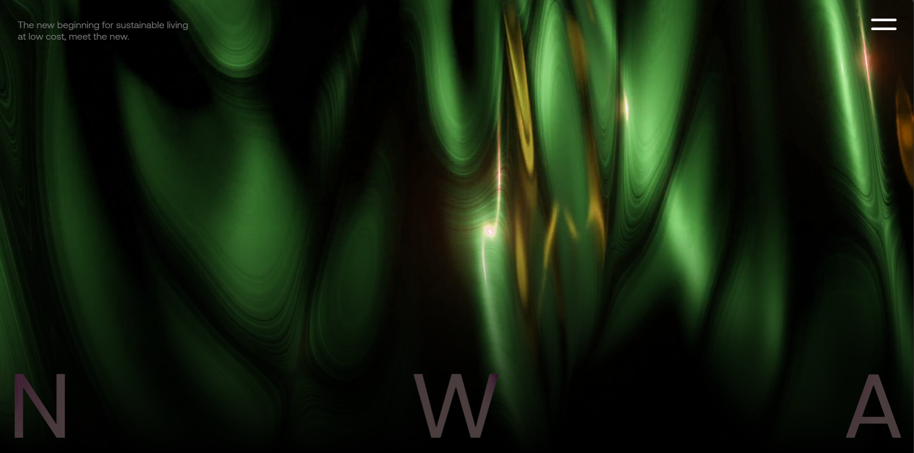

# NEWARCH - Inovação Tecnológica e Sustentabilidade

Bem-vindo ao repositório oficial da **NEWARCH**, uma empresa fictícia de inovação tecnológica que combina sustentabilidade, automação e design moderno para criar soluções que moldam o futuro. Este projeto foi desenvolvido como parte do meu Trabalho de Conclusão de Curso (TCC) e representa uma visão de como a tecnologia pode ser aliada à sustentabilidade para construir um mundo melhor.

## 🚀 Visão Geral

A **NEWARCH** é uma empresa que nasceu da ideia de unir **tecnologia**, **sustentabilidade** e **inovação**. Nosso objetivo é criar soluções inteligentes e eficientes que promovam um estilo de vida sustentável, sem abrir mão do conforto e da modernidade.

Este projeto é uma representação visual da marca, com um site moderno e interativo que utiliza tecnologias avançadas para proporcionar uma experiência única ao usuário.

## ✨ Funcionalidades

- **Design moderno e responsivo**: Focado em uma experiência visual impactante e acessível em qualquer dispositivo.
- **Animações fluidas**: Utilizando **GSAP** para criar efeitos visuais suaves e envolventes.
- **Rolagem suave**: Implementada com a biblioteca **Lenis** para uma navegação agradável.
- **Vídeos de fundo**: Para transmitir a essência inovadora e futurista da NEWARCH.
- **Menu interativo**: Com transições e efeitos que destacam a usabilidade e o design.

## 🛠️ Tecnologias Utilizadas

- **HTML5**: Estruturação do conteúdo.
- **CSS3**: Estilização e design responsivo.
- **JavaScript**: Interatividade e dinamismo.
- **GSAP (GreenSock Animation Platform)**: Para animações avançadas.
- **Lenis**: Para uma rolagem suave e moderna.

## 📁 Estrutura do Projeto

```
/NEWARCH-FINAL
│
├── /files
│ ├── /assets
│ │ ├── /font
│ │ ├── /img
│ │ └── /video
│ └── style.css
│
├── /pt-br
│ └── index.html
│
├── index.html
├── script.js
└── README.md

```

## 🌐 Sobre a NEWARCH

A **NEWARCH** é uma empresa fictícia que representa o futuro da tecnologia sustentável. Nosso foco é desenvolver soluções que integrem automação, eficiência energética e design inovador, promovendo um estilo de vida sustentável e acessível.

### Valores da NEWARCH:

- **Sustentabilidade**: Priorizamos soluções que respeitam o meio ambiente.
- **Inovação**: Utilizamos tecnologia de ponta para criar produtos e serviços revolucionários.
- **Acessibilidade**: Acreditamos que a tecnologia sustentável deve estar ao alcance de todos.

## 🎯 Objetivos Futuros

- Expandir o portfólio de projetos da NEWARCH, incluindo mais detalhes sobre produtos e serviços.
- Implementar funcionalidades interativas, como simuladores de economia de energia.
- Adicionar uma seção de blog para compartilhar notícias e insights sobre tecnologia e sustentabilidade.

## 🌐 Como Visualizar

Você pode acessar o projeto online através do link de deploy:  
🔗 **[Acessar Deploy](https://newarch.netlify.app/)**

Ou, se preferir, clone o repositório e abra o arquivo `index.html` no seu navegador:

```bash
git clone https://github.com/LeonardoNXT/NewArch.git
cd NEWARCH
```

Ou acesse o link do deploy (se disponível).

---



---

Feito com 💜 por [Leonardo](https://github.com/LeonardoNXT)
